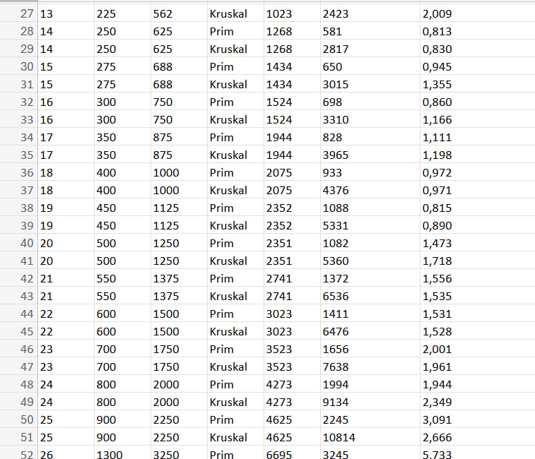

# Assignment 3: Optimization of a City Transportation Network (Minimum Spanning Tree)

## Project Overview

This project implements Prim’s and Kruskal’s algorithms to determine the Minimum Spanning Tree (MST) of a weighted graph. The idea is inspired by a real-world scenario where a city aims to connect all its districts with roads in the most cost-effective way.

## Implementation Details

### Kruskal's Algorithm:

#### Data Structure for Union-Find (DSU):

- The DSU (Disjoint Set Union) data structure is used to track connected components of the graph to avoid cycles. Each node has a parent, and the components are merged using union by rank.

#### Edge Sorting:

- The edges of the graph are sorted in ascending order of weight. Kruskal's algorithm adds edges to the MST starting with the lightest ones, ensuring the tree has the minimum possible weight.

#### Disconnection Check:

- After adding edges to the MST, the algorithm checks if the number of edges is less than V-1 (where V is the number of vertices). If so, the graph is disconnected, and a warning is printed.

### Prim's Algorithm:

#### Priority Queue for Edge Selection:

- A priority queue is used to select the edge with the minimum weight at each step. This ensures the greedy nature of Prim's algorithm, selecting the smallest possible edge at every step, thus constructing the minimum spanning tree.

#### Adjacency List Traversal:

- The algorithm uses an adjacency list to represent the graph. As each new node is added to the MST, all its adjacent edges are checked, and those leading to unvisited nodes are added to the priority queue.

#### Disconnection Check:

- If the number of edges in the MST is less than V-1, the graph is considered disconnected, and a warning is printed, indicating that the MST is incomplete.

### MSTResult (Common Class for Both Algorithms):

#### Storing Results:

- The MSTResult includes the list of edges that form the minimum spanning tree, the total cost of these edges, and the number of operations performed during the process.

#### Operations Counting:

- Both algorithms track the number of operations, such as unions (for Kruskal) and edge extractions (for Prim), which helps evaluate the efficiency of each algorithm.

#### Execution Time:

- The execution time of the algorithm is measured in milliseconds, which is crucial for performance analysis.

## Input Data

| Category | Vertices | Graphs |
|----------|----------|--------|
| Small | 5-25 | 5 | 
| Medium | 30-300 | 10 | 
| Large | 350-1000 | 10 | 
| Extra Large | 1300-2000 | 3 | 

## Results

- Both algorithms consistently generated the same total MST weight, which verifies their correctness.

### Performance Summary

| Algorithm | Avg Time | Min Time | Max Time | 
|-----------|----------|----------|----------|
| Prim | 1.50 ms | 0.116 ms | 5.79 ms |
| Kruskal | 1.25 ms | 0.073 ms | 5.733 ms |

### When Prim is Better:

- For Smaller Graphs: Prim tends to perform better when the graph has fewer vertices and a dense connection structure. Its performance benefits from using data structures like a priority queue that efficiently adds the minimum-weight edge. It is also faster for graphs with fewer edges and smaller sizes.

- Lower Operational Complexity: Prim's algorithm has a lower operation count when the graph is sparse and is represented using adjacency lists, particularly with priority queues or Fibonacci heaps. In such cases, its performance can be faster and more efficient.

### When Kruskal is Better:

- For Sparse Graphs: Kruskal is likely to perform better on sparse graphs where the number of edges is much smaller than the maximum possible edges. Since Kruskal’s time complexity is heavily dependent on sorting the edges and using union-find operations, it is particularly efficient when the number of edges is much smaller than the total possible number of edges.

- Simpler Implementation for Certain Graph Structures: Kruskal is easier to implement when dealing with edge-heavy graphs or matrices, as the edges are sorted and processed independently of the vertices, which can simplify implementation in some cases.

## Theoretical Comparison:

### Prim's Algorithm:

- Applied to dense graphs.
- Uses a priority queue data structure (typically a heap), which allows efficiently finding the minimum edges to expand the spanning tree.
- Time complexity: O(E log V), where E is the number of edges and V is the number of vertices.
- Suitable for graphs with a large number of edges, as its complexity depends heavily on the number of edges.

### Kruskal's Algorithm:

- Applied to sparse graphs.
- Works by sorting edges by weight and merging vertices using the Union-Find data structure.
- Time complexity: O(E log E), where E is the number of edges.
- Kruskal's algorithm performs better on sparse graphs because its complexity depends on the number of edges and the size of the sorting.

### Practical Application:

- In real-world conditions, both algorithms can be used to find the minimum spanning tree, but the choice depends on the type of graph.
- Prim's Algorithm is preferable for dense graphs, as it will process such graphs faster by using a priority queue.
- Kruskal's Algorithm is more efficient for sparse graphs, as its complexity does not depend on the graph's density.

### Advantages and Disadvantages:

- Prim's Advantages: Suitable for various types of graphs, with good performance when using efficient data structures for finding the minimum edges.
- Kruskal's Advantages: Simple to implement, especially with Union-Find for cycle detection. Efficient with a small number of edges.
- Prim's Disadvantages: May be slow when working with sparse graphs.
- Kruskal's Disadvantages: Requires sorting all edges, which can be costly for very large graphs.

# Conclusion

### When it comes to choosing between Prim's and Kruskal's algorithms for finding the Minimum Spanning Tree (MST), the preference depends on several factors:

### Graph Density:

- Prim's Algorithm generally works better with dense graphs, where the number of edges is significantly greater than the number of vertices. This is because Prim's algorithm uses a priority queue data structure, making it efficient for adding edges one by one.
- Kruskal's Algorithm is more efficient for sparse graphs, where there are fewer edges. Kruskal's algorithm works by sorting the edges, which may be more costly for dense graphs, but faster for sparse graphs as sorting edges is more efficient than processing all edges in Prim's algorithm.

### Edge Representation:

- Prim's Algorithm works directly with edges based on the adjacency structure, which may be less convenient for graphs with a large number of edges.
- Kruskal's Algorithm is preferred when edges are represented as a list, as it works with sorted edges and uses a data structure for merging edges, such as Union-Find.

### Implementation Complexity:

- Prim's Algorithm requires the use of a priority queue, making it somewhat more complex to implement, especially if the graph is not represented as an adjacency list.
- Kruskal's Algorithm is easier to implement, particularly when using a Union-Find data structure for cycle detection, and it works with a sorted edge list.

### Performance:

- The advantage of Prim's algorithm is its efficiency for dense graphs and its speed in finding the nearest edges using a priority queue.
- Kruskal's algorithm has lower time complexity for sparse graphs, as its main complexity comes from sorting the edges, which is especially advantageous when there are fewer edges.

### In general:

- For dense graphs, Prim's Algorithm is preferred.
- For sparse graphs, Kruskal's Algorithm is the better choice.

# Bonus

I developed graph visualizations for all 28 graphs.

# References

- Algorithms, 4th Edition (Sedgewick & Wayne) - Chapters 1.5 and 4.3 - https://algs4.cs.princeton.edu/lectures/keynote/43MinimumSpanningTrees-2x2.pdf?
- State‑of‑the‑Art Algorithms for Minimum Spanning Trees - https://www.cs.jhu.edu/~jason/papers/eisner.mst-tutorial.pdf?
